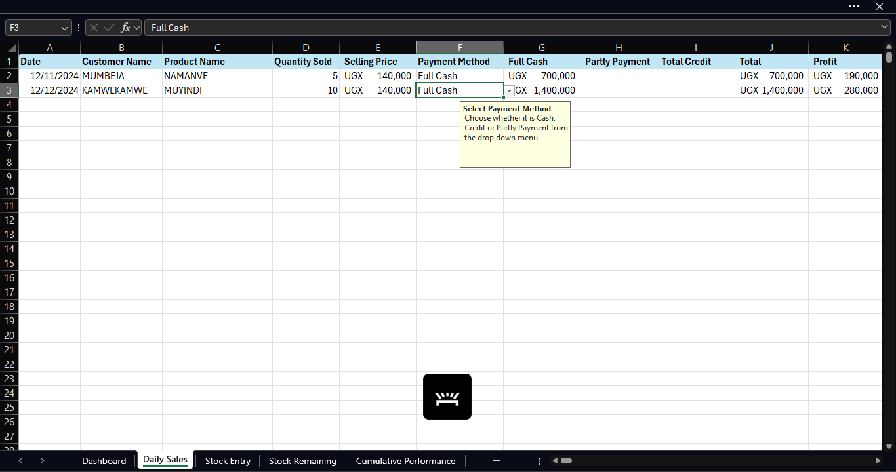
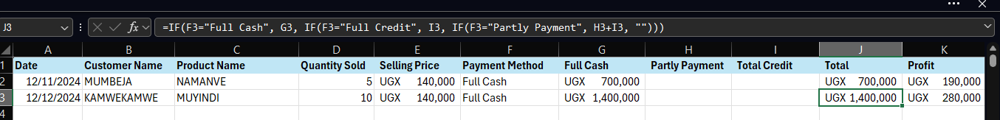
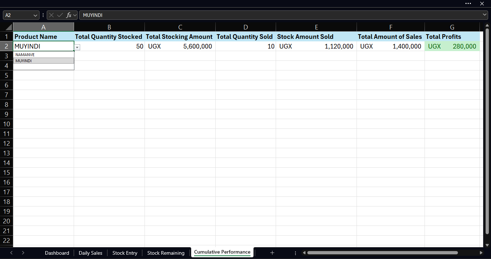

# Retail Business Bookkeeping & Inventory System (Excel)

A comprehensive Excel-based stock management and profit tracking system designed for small retail businesses, market vendors, and micro-enterprises in Africa.

**🔗 [View Live Demo (Google Sheets)](https://docs.google.com/spreadsheets/d/1NWepma4va31exp-pb2zOWLyrKK7wYag1/edit?usp=sharing&ouid=101699403049975759409&rtpof=true&sd=true)**  
** [Download Excel Template]( [Download Excel Template](https://github.com/dez-data/retail-bookkeeping-system/raw/main/Retail_Bookkeeping_System.xlsx)**)**

---

## The Problem This Solves

Small businesses across Africa lose money daily because they don't track their numbers:

 **"I sold a lot today, but I don't know if I made profit"**  
 **"I ran out of stock on my best-seller again"**  
 **"I think I'm making money on phone cases, but I'm not sure"**  
 **"I don't know what to reorder or how much"**  
 **"Accounting software costs more than my monthly rent"**  


---

## The Solution

A **free, powerful Excel system** that tracks:
 Stock levels (real-time)  
 Sales and revenue  
 Purchase costs vs selling prices  
 Profit per item and overall  
 What to reorder and when  

**No expensive software. Just Excel.**

---

## Key Features & Screenshots

### 1. Stock Management & Inventory Tracking


**What you see here:**
- **Stock input section** (top): Record when you receive new inventory
- **Current stock levels** (bottom): See what you have right now
- **Automatic calculations**: System updates stock as you record sales

**How it works:**
```excel
Current Stock = Stock Received - Stock Sold
Running Balance = Previous Stock + New Input - Sales
```

**Business impact:**
- Never run out of best-sellers
- See exactly what's in your store/warehouse
- Know when to reorder before stockouts

**Key columns:**
- Date stock received
- Product name
- Quantity received
- Purchase price (what YOU paid)
- Current stock level (auto-calculated)

---

### 2. Sales Tracking & Revenue Recording



.png

**What you see here:**
- Simple sales entry form
- Every transaction recorded with date
- Quantity sold per item
- Selling price per transaction
- Automatic revenue calculation

**How it works:**
- Record each sale as it happens
- System calculates: Revenue = Quantity × Selling Price
- Stock levels update automatically
- Running totals keep you informed

**Business impact:**
- Know your daily revenue instantly
- Track which products move fastest
- Spot sales patterns (busy days, slow periods)

---

### 3. Profit Analysis & Product Performance



**What you see here:**
- Profit calculated per product
- Purchase price vs selling price comparison
- Profit margin percentages
- Total profit tracking

**The critical calculations:**
```excel
Profit per Unit = Selling Price - Purchase Price
Total Profit = Profit per Unit × Quantity Sold
```


**Business impact:**
- **Stop guessing** which products make money
- **Discover loss-makers** (selling below cost)
- **Make pricing decisions** based on data
- **Focus on high-margin items**

---

## How The System Works

### System Architecture

**Data Flow:**
```
1. STOCK INPUT → Records inventory received
                ↓
2. SALES TRACKING → Records what sold
                ↓
3. CALCULATIONS → Auto-updates:
   - Current stock levels
   - Revenue totals
   - Profit per item
   - Reorder alerts
                ↓
4. REPORTS → Shows business performance
```

### Excel Features Implemented

**Advanced Formulas:**
- `SUMIF()` - Total sales by product
- `VLOOKUP()` - Fetch prices from master list
- Date calculations - Track time periods
- Running totals - Cumulative tracking

**Data Management:**
- **Data Validation:** Dropdown menus prevent errors
- **Protected Formulas:** Users can't break calculations
- **Linked Sheets:** Data flows between tabs automatically

**User Experience:**
- Simple data entry (minimal typing)
- Clear labels and instructions
- Beginner-friendly interface

---

## Quick Start Guide (5 Minutes)

### Step 1: Set Up Your Products (2 minutes)

**Go to "Price List" sheet:**
1. Enter product names
2. Enter purchase price (what you pay suppliers)
3. Enter selling price (what you charge customers)
4. System calculates markup automatically

**Example:**
```
Product: Phone Case
Purchase Price: 8,000 UGX
Selling Price: 12,000 UGX
→ System shows: 50% markup, 33% margin
```

---

### Step 2: Record Stock Received (30 seconds per entry)

**Go to "Stock Input" sheet:**
1. Enter date received
2. Select product
3. Enter quantity
4. Enter price paid
5. **Done** → Stock levels update

**Example:**
```
Date: 15/01/2025
Product: Phone Cases
Quantity: 50 units
Price: 8,000 UGX each
→ Stock level now: 50 units
```

---

### Step 3: Record Sales (30 seconds per sale)

**Go to "Sales Tracking" sheet:**
1. Enter date of sale
2. Select product sold
3. Enter quantity
4. Enter selling price
5. **Done** → Revenue calculated, stock reduced

**Example:**
```
Date: 15/01/2025
Product: Phone Case
Quantity: 3 units
Price: 12,000 UGX each
→ Revenue: 36,000 UGX
→ Stock reduced to: 47 units
→ Profit: 12,000 UGX (3 × 4,000 margin)
```

---

### Step 4: Monitor Performance (Daily check: 2 minutes)

**Check these key numbers:**
- Current stock levels (any low items?)
- Today's sales revenue
- Profit margin (making enough?)
- Best-selling products
- Items to reorder

---

## Real-World Applications

### Perfect For:

**Retail Shops:**
- Phone accessories stores
- Clothing boutiques
- Electronics retailers
- General merchandise

**Market Vendors:**
- Fruit & vegetable sellers
- Meat & fish vendors
- Household goods stalls
- Mobile market traders

**Agricultural Businesses:**
- Produce sellers
- Seed & input suppliers
- Farm equipment dealers
- Grain traders

**Service + Products:**
- Salons (tracking product inventory)
- Repair shops (parts inventory)
- Restaurants (ingredient tracking)
- Any business with physical stock

---

## What The Data Shows You

### Daily Insights:
- How much did I sell today?
- What was my profit today?
- Which products sold?
- Do I need to reorder anything?

### Weekly/Monthly Analysis:
- Best-selling products
- Most profitable items
- Slow-moving inventory
- Revenue trends over time
- Profit margin changes

### Business Decisions Enabled:
- **Which products to push:** High-margin items
- **What to stop selling:** Loss-makers or very slow movers
- **When to restock:** Before you run out
- **How much to order:** Based on sales velocity
- **Pricing adjustments:** Are margins too thin?

---

## Skills Demonstrated

### Business & Financial Skills:
 Bookkeeping principles (revenue, costs, profit)  
 Inventory management methodology  
 Profit margin analysis  
 Financial metrics tracking  
 Business operations understanding  

### Technical Skills:
 **Excel Formulas:** SUMIF, VLOOKUP, IF statements, date functions  
 **Data Modeling:** Multi-sheet relational structure  
 **Automation:** Calculations that eliminate manual work  
 **Data Validation:** Error prevention through dropdowns  
 **Conditional Formatting:** Visual alerts and indicators  
 **System Design:** Scalable, user-friendly architecture  

### Problem-Solving:
 Understanding real business pain points  
 Building practical tools that get actually used  
 User-centered design for non-technical users  
 Attention to accuracy and detail  

---

## Getting Started

### Download Options:

**1. Excel Desktop Version (Recommended)**
- [Download: Retail_Bookkeeping_System.xlsx](link)
- Requires: Microsoft Excel 2013 or later
- Full functionality with all features
- Works offline

**2. Google Sheets Version (Web-Based)**
- [Open Live Demo](google-sheets-link)
- Works on any device with internet
- Make a copy to use for your business
- Collaborate with business partners

---

## Detailed Documentation

### Sheet Descriptions:

**Stock Input Sheet:**
- Record inventory received
- Track supplier purchases
- Monitor stock additions
- Running stock balance

**Current Stock Sheet:**
- Real-time inventory levels
- Low stock alerts
- Stock valuation
- Reorder recommendations

**Sales Tracking Sheet:**
- Daily sales entry
- Revenue calculations
- Profit per transaction
- Customer records (optional)

**Profit Analysis Sheet:**
- Product profitability ranking
- Margin analysis
- Best/worst performers
- Loss-maker identification

**Summary Dashboard:(Still in development)**
- Key performance indicators
- Charts and visualizations
- Trend analysis
- Quick business health check

---

## Customization Options

**Easy modifications you can make:**

**1. Add Product Categories:**
- Electronics, Clothing, Food, etc.
- Filter and analyze by category
- See which categories are most profitable

**2. Adjust Alert Levels:**
- Change "low stock" threshold (default: 10 units)
- Set minimum margins for profit warnings
- Customize color alerts

**3. Add Customer Tracking:**
- Record customer names (optional)
- Track repeat customers
- Build customer database

**4. Expand to Multiple Locations:**
- Add location column
- Track stock by shop/warehouse
- Compare location performance

**5. Include Expenses:**
- Add rent, utilities, salaries
- Calculate net profit (revenue - costs - expenses)
- True business profitability

---

## Scaling Up

**When your business grows:**

**Still works for:**
 10-500 products 
 10-1000 transactions/month 
 Single location or multiple shops 

**Limitations:**
 Very large inventories (1000+ SKUs);  Consider database system
 High transaction volume (100+/day);  Consider POS system
 Complex manufacturing → Need production tracking

**Migration Path:**
 Start with this Excel system (FREE)
 Grow your business with proper tracking
 When revenue justifies it, upgrade to:
   QuickBooks (accounting software)
   Square/POS systems (for high volume)
   ERP systems (for complex operations)
 Your Excel data exports easily to these systems

---

## Support & Feedback

### Need Help?

**Common Issues:**
- Formulas not calculating? Enable automatic calculation (Formulas → Calculation Options → Automatic)
- Can't edit cells? Some cells are protected (by design). Only input cells are editable.
- Dropdowns not working? Make sure you're using the correct sheet for data entry.

**Contact:**
📧 Email: samuelasteragondeze@gmail.com  
💼 LinkedIn: https://www.linkedin.com/in/samuel-agondeze-kisoke  

### Share Your Story:

**Using this system?** I'd love to hear:
- What's working well?
- What's confusing?
- What features would help?
- Has it improved your business? (Share your success!)

Your feedback makes this better for everyone.

---

## About the Creator

**Samuel Agondeze Kisoke**  
Data Analyst | Statistics Graduate

**Why I built this:**

I've seen too many talented entrepreneurs fail because they didn't know their numbers. This Excel system is my way of helping—providing professional bookkeeping tools without the cost barrier.

**Other Projects:**
 [Ghana GDP Forecasting - Time Series Analysis (R)](https://github.com/dez-data/ghana-gdp-forecasting)
 [Agricultural Sector Analysis - Power BI + Python](https://github.com/dez-data/ghana-agriculture-analysis)
 [Full Portfolio](https://github.com/dez-data)

---

## Connect & Collaborate

**Questions? Need custom features? Want to collaborate?**

 Email: samuelasteragondeze@gmail.com  
 LinkedIn: [linkedin.com/in/samuel-agondeze-kisoke](https://linkedin.com/in/samuel-agondeze-kisoke)  
 GitHub: [github.com/dez-data](https://github.com/dez-data)  

**For businesses:** Need help adapting this for agriculture, services, or manufacturing? Reach out.

**For recruiters:** This demonstrates practical business tool development, Excel expertise, and user-centered problem-solving. See my full portfolio on GitHub.

---

## License & Usage

**License:** MIT License (Open Source)

**You can:**
 Use it FREE for your business  
 Modify it for your specific needs  
 Share it with other business owners  
 Use it commercially  

**All I ask:**
- If it helps you, share it with someone else who needs it
- Give credit if you share publicly (link back to this repo)
- Send feedback to help improve it

---

## ⭐ Support This Project

**If this system helps you or someone you know:**

⭐ Star this repository on GitHub  
🔗 Share it with other business owners  
💬 Leave feedback on what worked  
📧 Tell me your success story (seriously, I want to hear!)  

Every star helps more businesses discover this tool.

---

## Screenshots

### Stock Management Interface


*Track inventory received and current stock levels*

### Sales Recording


*Simple interface for recording daily transactions*

### Profit Analysis

*Know exactly which products make money*

---

*Because every business deserves to know their numbers—regardless of budget or technical expertise.*

---

**Last Updated:** January 2025  
**Version:** 1.0  
**Status:** Active - Feedback Welcome!  
**License:** MIT (Free to use)